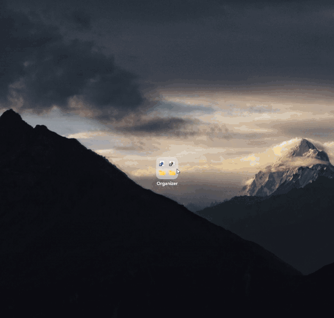
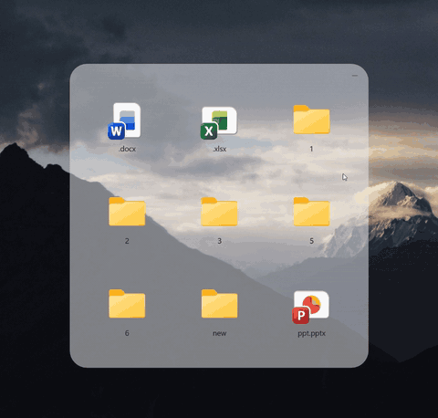
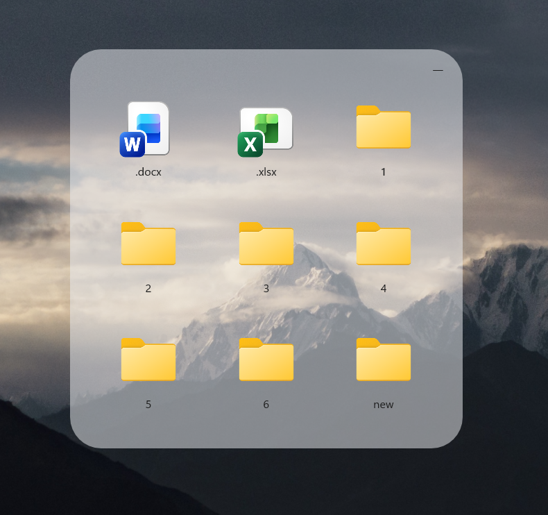
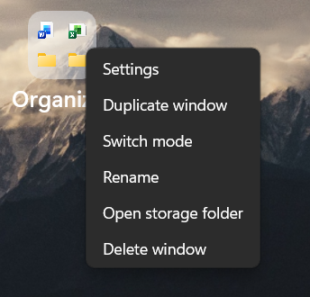
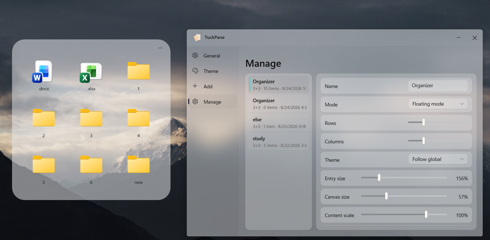
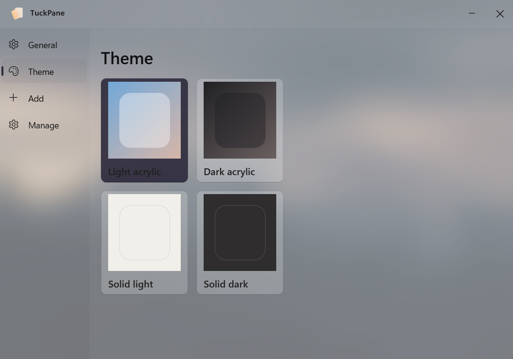

# TuckPane

[English](README.md) | [简体中文](README.zh-CN.md)

TuckPane is a desktop file organizer for Windows 11 x64. It keeps real files and folders inside compact desktop panes that expand when needed and stay out of the way the rest of the time.

## Demo

<p align="center">
  
  
  <br><sub>Left: expand and collapse a pane. Right: drag files to rearrange them inside a pane.</sub>
</p>

## Screenshots

<p align="center">
  
  <br><sub>Expand an organizer only when you need its contents.</sub>
</p>

<p align="center">
  
  <br><sub>Right-click for settings, duplication, mode switching, renaming, storage access, and safe deletion.</sub>
</p>

<p align="center">
  
  <br><sub>Adjust each organizer's grid, mode, theme, entry size, canvas size, and content scale.</sub>
</p>

<p align="center">
  
  <br><sub>Choose between light acrylic, dark acrylic, solid light, and solid dark themes.</sub>
</p>

### Quick actions

Drag files and folders directly into a pane, reveal a Station from a monitor edge, create notes beside real files, hold `Ctrl` and scroll to resize contents, and keep TuckPane running quietly from the system tray.

## Features

- Create up to 12 ordinary organizer panes in floating or desktop-positioned mode, plus edge-docked Station panes that reveal from a monitor's physical edge without taking keyboard focus.
- Create rich notes with pasted images, seven color themes, optional ruled lines, inline renaming, and saved window placement. Export or open portable `.tucknote` files without converting them into ordinary organizer state.
- Drag files, folders, application shortcuts, Steam `.url` shortcuts, and portable notes between panes or standard Windows targets with negotiated Copy, Move, or Link behavior.
- Resize the expanded canvas proportionally from every edge or corner. Canvas size and item layout are saved automatically.
- Hold `Ctrl` and use the mouse wheel over an expanded pane to adjust icon, label, and spacing scale.
- Optionally expand ordinary panes after hovering, collapse them after the pointer leaves, and choose whether only one pane may stay expanded.
- Paste files, create folders, cut items through the Windows clipboard, and move deleted real files to the Recycle Bin.
- Open settings, duplicate an empty pane, switch mode, rename, open its storage directory, or safely delete it from the context menu.
- Choose Light, Gray, Solid Light, or Solid Dark themes, with English, Simplified Chinese, and Japanese interfaces.
- Run silently from the system tray. Closing the settings window hides it; only **Exit** in the tray menu terminates TuckPane.

## Download

Current version: **2.0.0**. See the [Latest Release](https://github.com/ch998244353/TuckPane/releases/latest) for the complete release notes.

- [TuckPane-2.0.0-win-x64-setup.exe](https://github.com/ch998244353/TuckPane/releases/download/v2.0.0/TuckPane-2.0.0-win-x64-setup.exe): per-user offline installer with Start menu and desktop shortcuts.
- [TuckPane-2.0.0-win-x64-portable.zip](https://github.com/ch998244353/TuckPane/releases/download/v2.0.0/TuckPane-2.0.0-win-x64-portable.zip): extract it and run `00-启动 TuckPane.exe`.
- [SHA256SUMS.txt](https://github.com/ch998244353/TuckPane/releases/download/v2.0.0/SHA256SUMS.txt): SHA-256 checksums for both downloads.

Both packages include .NET and the Windows App SDK. No separate runtime is required. The installer is currently unsigned, so Windows SmartScreen may show an “Unknown publisher” warning; verify the download with `SHA256SUMS.txt` when needed.

System requirement: Windows 11 x64, build 22000 or later.

## Storage and data

New installations store organizer data under `%USERPROFILE%\TuckPane` and settings/cache under `%LOCALAPPDATA%\TuckPane`. If only legacy GlassFolder data exists, TuckPane continues to use it in place without copying or moving organizer files.

Each new pane uses one directory such as `%USERPROFILE%\TuckPane\Windows\Name-ID`; files are stored directly in that directory. You may instead select an existing dedicated directory as the pane's final storage location, and its current top-level contents appear immediately. TuckPane rejects broad or overlapping locations that could risk unrelated data.

Deleting a non-empty pane exports its entire storage directory to a uniquely named folder on the desktop before removing the pane. If export fails or is cancelled, the source directory and pane remain unchanged. Uninstalling TuckPane does not delete organizer files or settings.

## Build

Install .NET SDK 10.0.400 and Inno Setup 6, then run:

```powershell
.\scripts\build-release.ps1
```

Run the focused logic regression checks with:

```powershell
dotnet run --project .\tests\TuckPane.LogicChecks\TuckPane.LogicChecks.csproj -c Release -p:Platform=x64
```

## License

TuckPane is licensed under the [MIT License](LICENSE). Third-party runtime notices are listed in [THIRD-PARTY-NOTICES.md](THIRD-PARTY-NOTICES.md).
